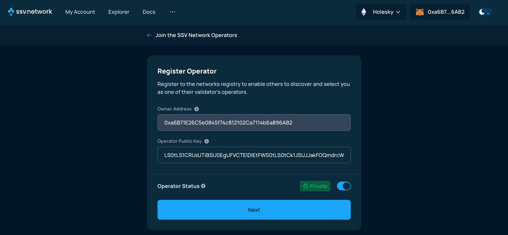
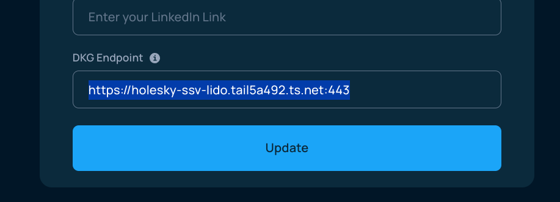
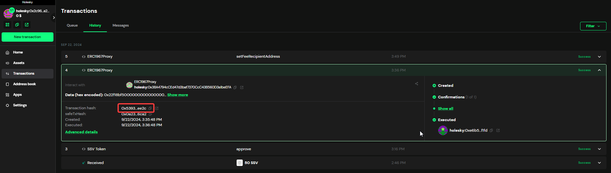
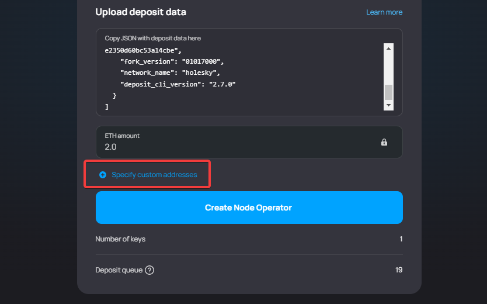
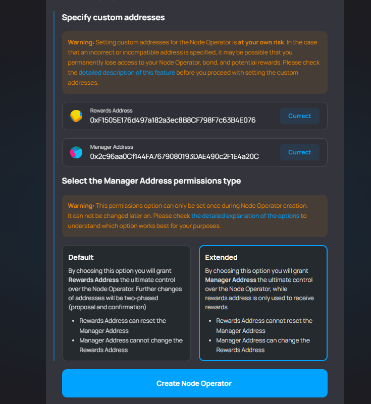

# SSV

[コミュニティステーキングモジュール](https://operatorportal.lido.fi/modules/community-staking-module)(CSM)は、[Lidoプロトコル](https://lido.fi/)の最初のパーミッションレスモジュールであり、誰でも通常の(「バニラ」)イーサリアムバリデーターを実行するよりもはるかに高い資本効率でイーサリアムブロックチェーン上でバリデーターの実行を開始できます。

分散型バリデーター([DVT](https://ethereum.org/en/staking/dvt/))は、複数のノードで実行されるイーサリアムバリデーターです。 [SSV Network](https://ssv.network/)は、実行中の分散バリデーターにパーミッションレスなアクセスを提供するツールのセットです。

このチュートリアルでは、デモンストレーション目的でHoodiテストネットを使用しますが、メインネットにも同じ手順を適用できます。

## Hardware & system requirements

EL/CLノードとは分離して実行するため、SSV単体のリソース要件です。

- https://docs.ssv.network/operators/operator-node/node-setup/hardware-requirements/

```
💻 Machine running Ubuntu (preferably LTS 22.04)

🎛️ 2 cores

⚡️ 2GB RAM

📀 20GB storage (10GB minimum)

🧮 IOPS > 8K
```

可能であれば、ベストプラクティスを満たすように設定してみて下さい。

- https://docs.ssv.network/operators/operator-node/node-setup/best-practices

一部は system.md に書き写しているものもあるので参照しながら設定して下さい。

## Getting started

信頼性が最小限に抑えられた分散型Valdatorクラスターを作成します。

管理用のSafeマルチシグウォレット、オペレーターに報酬を分配するためのSplits、およびSSV DVTを実行するために必要なクライアントソフトウェアが必要です。

また、オペレーターは、任意のEL/CLクライアントを備えた完全なイーサリアムノードと、Lidoが承認したリレーの少なくとも1つで構成されたMEVブーストクライアントも必要です。

MEVブーストクライアントはGCP Cloud Runで稼働させます。リージョンに注意して下さい。

## The SSV client

SSVが公式に提供するコンテナセットアップは [ssv-stack](https://github.com/ssvlabs/ssv-stack) にあります。

トラブルシューティングに関するドキュメントは [gitbook-docs](https://github.com/ssvlabs/gitbook-docs/blob/main/docs/operators/operator-node/maintenance/troubleshooting.md) にあります。

### Setup

```
git clone https://github.com/ssvlabs/ssv-stack.git ssv-stack-001
```

1. ssv.env
    - 環境変数を更新します
        ```
        cd ssv-stack-001
        cp ssv.example.env ssv.env
        vi ssv.env
        ```
    - 以下の変数を自身の環境に合わせて変更します。
        | Key | Value | Example (2 or more) |
        |-----|-------|---------|
        | `BEACON_NODE_ADDR` | https://trdiyt.michizane.com/ | https://trdiyt.michizane.com/;https://i7bbt.michizane.com/ |
        | `ETH_1_ADDR` | wss://trdiyt.michizane.com/ws | wss://trdiyt.michizane.com/ws;wss://i7bbt.michizane.com/ws |
        | `PRIVATE_KEY_FILE` | /data/encrypted_private_key.json | |
        | `LOG_LEVEL` | - | debug |
        | `LOG_FILE_PATH` | - | /data/logs/debug.log |
        - ELやCLを2つ以上を指定する場合は [best-practices](https://docs.ssv.network/operators/operator-node/node-setup/best-practices/) を参照して下さい。
1. docker-compose.yml
    1. `docker-compose.yml`を開く
        ```
        vi docker-compose.yml
        ```
    1. ファイル末尾の `networks` に他コンテナセットアップと重複しない名前を指定します
        - `local-docker-ssv-110`とか、`local-ssv-node-001` とか
    1. `service.ssv-node.ports` を実行環境に合わせて、`service.ssv-node.networks` をファイル末尾の `networks` に合わせます
    1. `service.prometheus.ports` を実行環境に合わせて、`service.prometheus.networks` をファイル末尾の `networks` に合わせます
    1. `service.grafana.ports` を実行環境に合わせて、`service.grafana.networks` をファイル末尾の `networks` に合わせます
    1. `service.ssv-dkg.networks` をファイル末尾の `networks` に合わせます
    1. `service.ssv-pulse` の `command` を設定します
        - `--consensus-addr`と`--execution-addr`は `<ip>:<port>` 形式で記述する必要があります
1. Generating Operator Keys
    - 設定に誤りがないかを含めて実行を試します
        ```
        docker compose up
        ```
        - `--profile dkg` を指定せずに実行して下さい
    - 初回起動時 `ssv-key-generation` が鍵を生成します
        - 環境変数 `PRIVATE_KEY_FILE` で指定したファイルが生成されます
    - 生成された公開鍵を控えておいて下さい
        ```
        cat ssv-node-data/encrypted_private_key.json | jq .pubKey
        ```
        - SSVに登録する際に必要になります
    - **この時点で、各オペレーターは以下のファイルのバックアップを作成する必要があります**
        - `ssv-node-data/password`
        - `ssv-node-data/encrypted_private_key.json`

## Creating the DV cluster wallet

Safe Wallet作成方法の手順については、[こちら](https://help.safe.global/en/articles/40868-creating-a-safe-on-a-web-browser)をご覧ください。Hoodi Testnet Safeのデプロイメントは、 [protofire.io](https://app.safe.protofire.io/welcome) にあります

クラスタメンバーの1人は、すべてのクラスタメンバーから署名者アドレスを取得し、自分の署名者ウォレットを接続して、新しいSafeを作成することを選択する必要があります。


Safeに名前を付け、Hoodiネットワークを選択した後、`Next`ボタンをクリックして続けます。


次に全クラスタメンバーの署名者アドレスを追加し、`Next`ボタンをクリックして最後の手順に進みます。


最後に`Create account`ボタンをクリックしてSafeを作成するためのトランザクションを送信します。


アカウントをアクティベートするためにトランザクションを実行する必要があるため、接続したウォレットに入金が必要です。

## Creating the reward split contract

ssv.networkではSplists Team(Beta)を利用します。

(WIP)

## Registering the operator

SSVオペレーターレジストリは https://app.ssv.network にあります。

オペレーターを登録するには、各クラスターメンバーがウォレットを接続し、右上隅にあるネットワークを `Hoodi` に変更して `Join as Operator` ボタンをクリックしてください。


`Register Operator` ボタンをクリックしてください。


Setup項の手順3で生成した公開鍵を入力し、`Private`トグルを選択して次の手順に進みます。



オペレーター料金に 0 を設定し、 `Next`ボタンをクリックします。


最後に、`Register Operator`ボタンをクリックしてオペレーターを登録し 、トランザクションに署名します。


トランザクションが実行されると、オペレーターを使用する準備が整います。


オペレーターIDをメモし、 `Manage Operator`ボタンをクリックします。


右上隅にある3つのドットボタンを選択し、 `Permission Settings`オプションを選択します。


`Authorized Addresses`オプションをクリックします。


Safeウォレットのアドレスを入力し 、`Add Addresses` ボタンをクリックしてトランザクションに署名します。


## Running the Distributed Key Generation (DKG) service endpoint.

DKG を実行するには、各オペレーターが`ssv-dkg`ノードのサービスを有効にする必要があります。

これを行うには、各クラスター・メンバーは、まずファイル内でオペレーター ID を設定する必要があります。

### dkg-data/operator.yml

以下のファイルの記述を更新します。

```
privKey: ./ssv-node-data/encrypted_private_key.json
privKeyPassword: ./ssv-node-data/password
operatorID: 199
network: "hoodi"
port: 3030 
logLevel: info
logFormat: json
logLevelFormat: capitalColor
logFilePath: ./data/debug.log
outputPath: ./data/output
ethEndpointURL: http://trdiyt.michizane.com/rpc #HTTP Address of Execution Node
```
- `network`に`"hoodi"`を指定します
- `operatorID`に前述でメモしたIDを指定します
- `ethEndpointURL`に対象の実行クライアントURLを指定します

### Sharing the DKG service

```
docker compose --profile dkg ssv-dkg up
```

### Testing the DKG endpoint

オペレータは、次のコマンドを実行して DKG エンドポイントをテストできます。

```
docker compose --profile dkg run --rm ssv-dkg ping --ip https://xxx.xxx.xxx.xxxx:3030
```

正常に設定されると、次のようなメッセージが表示されます。


## Publishing the DKG endpoint to the operator registry

画面の右上隅にある 3つのドットボタンを選択し、`Operator details` `Edit Details` オプションを選択します。


画面下部の`DKG Endpoint`フィールドにURLを入力し、`Update`ボタンをクリックして、署名で変更を確認します。



## Creating the DV cluster

公式の SSV ドキュメントには、分散クラスターの設定に関する詳細な手順が含まれています。

### Creating the cluster configuration

すべてのクラスターメンバーがオペレーターを登録すると、クラスターメンバーの 1 つが SSV Web アプリを開き、`Safe`クラスターウォレットを接続します。


それから次のページの`Distribute Validator`ボタンをクリックします。


そして `Generate new key shares` ボタンをクリックします。


クラスターサイズを選択し、リストからクラスターオペレーターを選択して、 `Next`ボタンをクリックします。


`Offline` ボタンをクリックします。


次の画面で、クラスターが実行するバリデーターの数を選択し、`Withdrawal Address` に Lido の[ドキュメント](https://docs.lido.fi/deployed-contracts/hoodi-lidov3) に従って、`Withdrawal Vault` を指定し、 その横にある`Confirm`ボタンをクリックします。

注記: メインネットの `Withdrawal Vault addresses` は `0xB9D7934878B5FB9610B3fE8A5e441e8fad7E293f` ([source](https://docs.lido.fi/deployed-contracts/))


確認したら、オペレーティングシステムを選択し、`DKG ceremony`コマンドをコピーします。このコマンドは`Docker`がインストールされている任意のマシンで実行できます。

コマンドを実行すると、DKGセレモニーが無事に完了したことを示す次のような画面が表示されます。


いくつかの `ceremony-yyyy-MM-dd--hh-mm-ss.mmm` ファイルが生成され、バリデーターキーごとに複数のサブフォルダを持つ `[nonce]-[validator_pubkey]`:

`deposit-[validator_pubkey].json` - このファイルには、バリデーターをアクティブ化するために必要なデポジットデータが含まれています

`keyshares-[validator_pubkey].json` -  - このファイルには、バリデータを`SSV`ネットワークに登録するために必要なキーシェアが含まれています 

`proofs.json` - このファイルには、セレモニーがクラスターオペレーターによって行われたことを示す署名が含まれており、将来、バリデーターを別のオペレーターと再共有するために重要です。

**すべてのファイルを安全にバックアップしてください。**


ウェブブラウザに戻り、バリデーターの入金に関する記述を確認し(ただし、現時点ではまだ行われていません)、`Register Validator`ボタンをクリックしてください。


登録しようとしているバリデーターを選択し、`Next`ボタンをクリックします。

注記: 1回のトランザクションで登録できるバリデーターは20人までに制限されています。これは、`Safe`Walletの制限によるものです。このため、1つのkeyshares.jsonファイルから20人以上のバリデータを登録する必要がある場合は、実際にDKGセレモニーを実行せずに上記の手順を繰り返し、同じkeyshares.jsonファイルを複数回アップロードする必要があります。SSV Webアプリは、以前に登録されたバリデーターを「自動的に」認識し、スキップします。


資金調達画面で、クラスターの実行時間を選択し、`Next`ボタンをクリックします。

注記: HoodiネットワークでSSVトークンを取得するには、公式のSSV [Faucet](https://faucet.ssv.network/request)を使用できます。


クラスターの残高と手数料に関する警告を確認して同意し、`Next`ボタンをクリックします。


スラッシングリスクに関する警告を確認して同意し、`Next`ボタンをクリックします。


SSVの支払いを承認します。


`Safe`でトランザクションに署名し、他のクラスタメンバーと共有します。


署名のしきい値に達し、トランザクションが実行されたら、`Register Validators`ボタンをクリックします。


再度署名し、トランザクションを他のクラスタ・メンバーと共有します。


最後のステップは、クラスター料金の受取人をLidoの`Execution Layer Rewards Vault` - `0x99137683D4AAfaf76C84bD8F6e2Ae6A95DF90912` に指定します。

これを行うには、`My Account`タブをクリックし、`Fee Address`ボタンをクリックします。


`Fee Recipient Address`フィールドをLidoの[ドキュメント](https://docs.lido.fi/deployed-contracts/hoodi-lidov3)に従って`Execution Layer Rewards Vault: 0x99137683D4AAfaf76C84bD8F6e2Ae6A95DF90912`を設定し、`Update`ボタンをクリックします。

注記: メインネットの`Fee Recipient address`は`0x388C818CA8B9251b393131C08a736A67ccB19297`([source](https://docs.lido.fi/deployed-contracts))


再度`Safe`にサインインし、トランザクション承認のために他のクラスターメンバーと共有します。


この後、バリデーターを`Lido CSM`に登録する準備が整います。

## MEV Boost

### What is MEV

MEVとは「Maximal Extractable Value（最大抽出可能価値）」の略です。これは、ブロック提案者が提案するブロックに含めるトランザクションの選択や順序を最適化することによって得られる追加の価値を指します。この最適化には、高度なアルゴリズムの使用や、通常のノード運用者にはアクセスできないリソースが必要となることが多く、これを行える主体は「サーチャー（`Searcher`）」と呼ばれます。`Searchar`は最も利益が出るトランザクションを見つけ、それらをバンドル（束）にして「ブロックビルダー（`Block Builder`）」に提供し、ビルダーはそれらのバンドルを組み合わせて完全なブロックを構築します。

各エポックの開始時に、ノード運用者は自身が管理するバリデータを任意の`Block Builder`（または`Relay`）に登録します。そして、ブロック提案の役割に選ばれた場合、`Relay`が提供するブロックを提案することで追加のチップ（報酬）を得ることができます。もし運用者が複数の`Relays`に接続したい場合は、「`MEV-Boost`」と呼ばれるソフトウェアが必要です。`MEV-Boost`を使用することで、接続されているすべての`Relays`の中から最も利益の高いブロックを選ぶことができ、これにより「ブロック・マーケットプレイス（`Block Marketplace`）」のような仕組みが実現されます。

Lido CSMの文脈においては、`MEV-Boost`の実行が要件となっている点に注意が必要です。現時点では、自前で構築したブロックを提案することによるペナルティはありませんが、将来的には変更される可能性があります。

### Configuring the MEV-boost client

この仕組みにおいて`MEV-Boost`は`GCP`の`CloudRun`で稼働させます。

設定についての詳細は`CloudRun`の`Deployments`に設定してある環境変数の内容を確認してください。

**未承認のリレーの使用は固く禁じられています。すべてのクラスタメンバーは、コンセンサスの欠如によるブロック提案の欠落を避けるために、同じ設定(同じリレー)を使用する必要があります。**

## Verify Cluster Registration (optional step)

Lido CSM モジュールにキーをデプロイする前に、各クラスタ メンバーは、SSV に登録されたキーが DKG 経由で作成したものと同じであることを確認できます。そのためには、彼らは次のことを行う必要があります。

`Safe`ウォレットアプリで、バリデーターをSSVに登録したトランザクションを特定し、`Copy`アイコンをクリックしてトランザクションハッシュをコピーします。



次に、クラスタディレクトリで次のコマンドを実行します。

```
docker run --rm\
-u root:root \
-v $(pwd)/dkg-output:/dkg \
-v $(pwd)/merge-output:/output \
raekwonthethird/ssv-automate:v0.0.4-holesky \
merge-deposit /dkg -t <TX_HASH_FROM_SAFE> -o /output
```

予想される結果は、次の画面のようになります。


このツールは、SSV APIを使用して、登録されたバリデーターの有効性(つまり、キー共有、ユーザーナンス、および関連するオペレーターキーの正確性)を検証します。

セキュリティを強化するために、クラスタの参加者は、集合体の公開鍵を視覚的に確認することができます。
`merge-output`フォルダの中にある`deposit-data.json`に移動して、SSV に登録されているものと一致することを確認します。

これを行うには、クラスターのマルチシグアカウントで[SSV Web](https://app.ssv.network/)アプリにログインします。`My Account`ページで、クラスタが 1 つしかなく、その中のオペレータが予期されるクラスタ参加者であることを確認します。(少なくとも)バリデーターの1つの公開鍵をクラスターからコピーするには、コピーアイコンをクリックします。


次に、`merge-output`フォルダ内の`deposit-data.json`ファイルを`grep`して、一致する公開鍵があることを確認します。

```
cat merge-output/deposit_data-yyyy-MM-ddThh-mm-ssZ.json \
| grep --color -E <validator_pub_key>
```


## Deploy the keys to Lido CSM

クラスタメンバーの 1 人は、このアドレス https://csm.testnet.fi/?mode=extended を使用して Lido CSM ウィジェットを開きます。
`mode-extended`パラメータに注意してください。これにより、Lido CSMの報酬アドレスを以前に作成した分割契約に設定することができます。
`WalletConnect`を使用してクラスタ`Safe`をウィジェットに接続します。


接続リンクをコピーします...


それを `Safe` `WalletConnect` 画面に貼り付けます。


次に`Create Node Operator`ボタンをクリックします。


`Upload deposit data`フィールドに`deposit-data.json`の中身を貼り付けます。

クラスター`Safe`には、債券をカバーするのに十分なETH/stETH/wstETHが預けられている必要があります。


`Specify custom addresses`セクションを展開します...



`Reward Address`を`Splits`コントラクトアドレスに指定、`Manager Address`フィールドを`Safe`ウォレットアドレスに指定します。

**オペレーターを作成する前に、必ず`Extended`オプションを選択してください。**

そうしないと、最終的に報酬アドレスがノードオペレーターを制御することになり、これは単純なスプリッターコントラクトであり、署名機能がないため、オペレーターに変更を加えることができません。

正しいアドレスが設定されていることを確認し、`Create Node Operator`ボタンをクリックします。



`Safe`でトランザクションに署名し、他のクラスタメンバーと共有します。


取引に署名する前に、残りのメンバーは、取引の詳細に正しいマネージャーアドレス(`Safe`のアドレス)と報酬アドレス(Splitsコントラクトのアドレス)が含まれていることを確認する必要があります。


署名のしきい値に達し、トランザクションが実行されると、クラスタはLido CSMから入金する準備が整います。


## Monitoring the CSM operator

この[ガイド](https://dvt-homestaker.stakesaurus.com/bonded-validators-setup/lido-csm/monitoring-and-address-management)に従って、 CSM オペレーターを監視するために必要な手順を確認できます。

## Claiming Rewards

CSMの報酬には、ボンズ報酬とオペレーター報酬の2種類があります。Lido CSMの債券はstETHで保持されており、stETHはラバシングトークンであり、1日1回バランスが変化します(おそらく増加します)。オペレーターの報酬は、ノードの運用から得られ、実行レイヤーとコンセンサスレイヤーの報酬の一部が含まれます。これらはすべてのオペレーターに共通しており、オペレーターが一定の閾値を超えた場合に授与されます。これは、Holeskyテストネットでは7日ごと、メインネットでは28日ごとに計算されます。

報酬を請求するには、`Bond & Rewards`メニューで`Claim`タブを指定します。

**警告:報酬はwstETH(Wrapped Staked Ether)で請求してください。これはSplitコントラクトと互換性のある唯一のトークンです。ETHをリクエストすると、スプリッターコントラクトでは配布できない出金請求を表すNFTを受け取ります。 stETHはリベーストークンであり、供給量が減少または増加すると、すべての受信者が自分のシェアを引き出すことができなくなるか、利回りがスプリットで停止します。詳細については、splits.org のドキュメントを参照してください。**


## Exiting Validators

[SSV Web](https://app.ssv.network/)アプリを使用してバリデーターを終了できます。


バリデータの`Exit`トランザクションが承認されるまでは若干時間がかかります。

なお、Lido CSMの担保を引き出す祭にも若干の制約があるため、以下のFAQに着目して下さい。

```
バリデーターはいつ出金されますか?

イーサリアムネットワークでは、コンセンサスレイヤーから正常に終了した後にバリデーターを引き出すことができますが、引き出しの正確なタイミングは、イーサリアムのプロトコルの仕組みに関連するいくつかの要因によって異なります。

エグジットキュー:バリデータがイグジットを開始すると、エグジットキューに入ります。エグジットに必要な時間は、エグジットするバリデータの数とチャーンリミット(エポックごとにエキッドごとにエグジットまたはエンターできるバリデーターの数)によって異なります。
引き出しプロセス:アクティブなバリデータセットを終了した後、バリデータは引き出し可能な状態になります。この状態は、引き出し可能なエポックによって決定され、エグジットエポック + 最小遅延の 256 エポック (~27 時間) に設定されます。
出金の確定:出金可能なエポックに達すると、バリデーターの残高は、コンセンサスレイヤーの出金スイープサイクルの次の反復内で、バリデータの出金資格情報(Lidoプロトコルの場合はLido Withdrawal Vault)に転送されます。これにかかる時間は、スイープサイクル全体におけるバリデータの位置と、引き出し可能なエポックとそのターンがスイープされるタイミングとの間の時間差によって異なります。出金が発生すると、出金の事実を無許可でCSMに報告することができます。これが発生すると、このバリデーターに使用されているNode Operatorのボンドの一部が解放されます。この時点で、ノードオペレーターは「ボンド&リワード請求」タブでボンドを請求することができます。
```

**利用している実行クライアントのRPC URLのレートリミットにかかってトランザクションが送れないことがありますので注意してください。**

上記を避けるためには自身のノードか信頼のあるノードにトランザクションを送るようにすれば良さそうですが、やり方は追々で。
