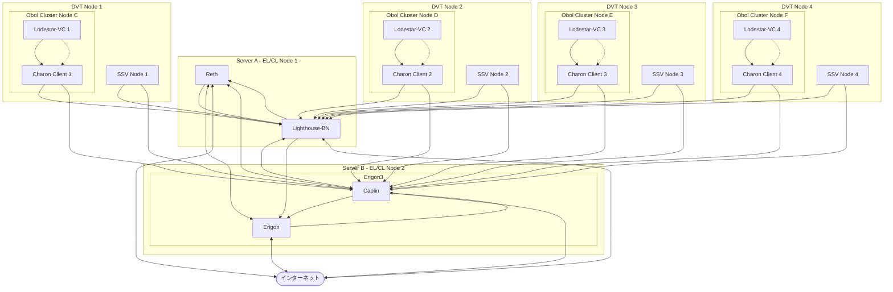

Bonded Validator + DVT

# 概要

Bonded Validator と DVT を利用して拡張可能なステーキング戦略を準備する

それぞれのノードオペレーターとして参入するにあたって、DVT技術を活用・流用する

**ブロックビルダー**もしくは**MEVサーチャー**として活用できるバリデーターを構築運用する

つまり、最終的にはバリデータを運用することでエコシステムの改善とMEV抽出機会を探すことを目的とする

# アドレス設計

[アドレス設計のレポート](./address-architect.md)に従って下記トレードオフから**Tier 1**を採用します。

## アドレスアーキテクチャのトレードオフ分析

| アーキテクチャモデル | 中核となる原則 | セキュリティレベル | 運用上の複雑性 | ガス代コスト | 柔軟性・プログラム可能性 |
|---|---|---|---|---|---|
| Tier 0：分離されたHWウォレット | 最大限の分離とシンプルさ | 最高 | 高 | 低 | 低 |
| [Tier 1](./address1.md)：分離されたHWウォレット | 最大限の分離とシンプルさ | 最高 | 高 | 低 | 低 |
| [Tier 2](./address2.md)：マルチシグ財務ハブ | 統合とM-of-Nによる保護 | 高 | 中 | 中 | 中 |
| Tier 3：ハイブリッド・自動化モデル | オンチェーンでの自動化 | 最高 | 最高 | 高 | 最高 |

### Tier 0

Tier 1はBIP-44の`account'`回想を使う設計ですが、そもそも扱えるクライアントがほぼない欠点があります。

そのため、ここではTier 0として`account'`や`change`は利用せず、`address_index`とパスフレーズのみを利用した設計とします。

#### 導出パススキーマ

| ロール | ウォレット | パスフレーズシンボル | 目的 | 完全な導出パス | 推奨アドレスインデックスの利用法 |
|----|----|----|----|----|----|
| **Vault** | **Solo** | `A` | **ソロ: 出金アドレス** | `m/44'/60'/0'/0/0` | `address_index=0` のみ使用。 |
| **Valut** | **LEB8** | `A` | **Rocket Pool: LEB8プライマリ出金アドレス** | `m/44'/60'/10'/0/0` | `address_index=0` のみ使用。 |
| **Valut** | **LEB4** | `A` | **Rocket Pool: LEB4プライマリ出金アドレス** | `m/44'/60'/10'/0/0` | `address_index=0` のみ使用。 |
| **Valut** | **CSMv2** | `A` | **Lido CSM v2: 報酬アドレス** | `m/44'/60'/0'/0/0` | `address_index=0` のみ使用。 |
| **Valut** | **Puffer2** | `A` | **Puffer.fi: 報酬アドレス** | `m/44'/60'/0'/0/0` | Base L2上でのリワード。 |
| **Valut** | **Puffer1** | `A` | **Puffer.fi: 報酬アドレス for TEE use** | `m/44'/60'/0'/0/0` | Base L2上でのリワード。 |
| **Valut** | **Diva** | `A` | **Diva-Staking: 報酬アドレス** | `m/44'/60'/0'/0/0` | `address_index=0` のみ使用。 |
| **Operations** | **Solo** | `B` | **ソロ: 手数料受取人** | `m/44'/60'/0'/0/0` | `address_index=0` のみ使用。 |
| **Operations** | **CSMv2** | `B` | **Lido CSM v2: 管理者アドレス** | `m/44'/60'/0'/0/0` | `address_index=0` のみ使用。 |
| **Operations** | - | `B` | 一般的な送受金 | `m/44'/60'/0'/0/x` | プライバシー保護のため`x`をインクリメント。 |
| **Operations** | - | `B` | DeFiプロトコル、その他運用 | `m/44'/60'/0'/0/x` | プロトコルごとにアカウントを分離。 |

##### パスフレーズシンボルの定義と記録

**「Vault」パスフレーズシンボル**: `A`

Dicewareのような手法や、高品質なパスワードジェネレーターを用いて、記憶不可能な、非常に長く複雑なパスフレーズを生成する

- 例: `8$Lp!v^7G#z@qW2&eR*tY9uI1oP5a`

**「Operations」パスフレーズ**: `B`

憶可能だが十分に強力なパスフレーズ（例：複数の無関係な単語を組み合わせたもの）を生成する

- 例: `correct-horse-battery-staple-galaxy`

# システム構成

実行クライアントやコンセンサスクライアント、及びDVTで利用するクライアントの比較と選定

## レポジトリ

| No. | Role | Name | URL | Desc |
|-----|------|------|-----|------|
| 0 | documents | nodoc | - | このページを含むドキュメント群 |
| 1 | Reth,Lighthouse | rethhnode | https://github.com/paradigmxyz/reth/tree/main/etc | rethとlighthouseのdocker関連ファイル群 |
| 2 | Erigon | erigonode | https://github.com/zaitsu/erigonode | erigon3のdocker関連ファイル群 |
| 3 | Nethermind,Nimbus | nenimnode | - | NethermindとNimbusのdocker関連ファイル群 |
| 4 | SSV | ssv-stack | https://github.com/ssvlabs/ssv-stack | ssv公式のスタック |
| 5 | Obol | charon-distributed-validator-node | https://github.com/ObolNetwork/charon-distributed-validator-node | obol公式のスタック |


## 実行環境

| No. | Unit | Place | Price | Role | How | Core/Thread (CPU) | Memory | NVMe SSD | mainnet | hoodi | Desc |
|-----|------|-------|-------|-----|-------------------|--------|----------|---------|-------|------|------|
| 1 | **1** | home | - | EL/CL | DIY |  12 core / 24 thread (AMD Threadripper 2920x) | 32GB | 4TB, 300GB, 30GB | trdiym.michizane.com (reth,lighthouse) | trdiyt.michizane.com (erigon3,caplin) | vc1〜vc5 |
| 2 | **1** | home | - | EL/CL | Shuttle | 8 core / 16 thread (Intel Core i7-11700) | 64GB | 2TB | i7bbm.michizane.com (erigon3,caplin) | i7bbt.michizane.com (reth,lightouse) | |
| 3 | 0 | [xserver](https://vps.xserver.ne.jp/) | 720円 / month (12ヶ月) | dvt | vps | 3 vCPU | 2GB | 50GB | - | - |  |
| 4 | **1** | [shin](https://www.shin-vps.jp/) | 840円 / month (12ヶ月) | dvt | vps | 3 vCPU | 4GB | 50GB | - | - | ssv |
| 5 | 0 | [conoha](https://www.conoha.jp/vps/?) | 641円 / month (12ヶ月) | dvt | vps | 3 vCPU | 2GB | 100GB | - | - |  |
| 6 | 0 | [kagoya](https://www.kagoya.jp/vps/) | 715円 / month | dvt | vps | 2 vCPU | 2GB | 200GB | - | - |  |
| 7 | 0 | [webarena](https://web.arena.ne.jp/indigo/) | 1,630円 / month | dvt | vps | 2 vCPU | 2GB | 200GB | - | - |  |
| 8 | **1** | [xserver](https://vps.xserver.ne.jp/) | 1439円 / month (12ヶ月) | dvt | vps | 4 vCPU | 6GB | 150GB | - | - | ssv |
| 9 | 0 | [shin](https://www.shin-vps.jp/) | 1610円 / month (12ヶ月) | dvt | vps | 4 vCPU | 8GB | 100GB | - | - |  |
| 10 | **1** | [conoha](https://www.conoha.jp/vps/) | 1082円 / month (12ヶ月) | dvt | vps | 4 vCPU | 4GB | 100GB | - | - | ssv |
| 11 | 0 | [kagoya](https://www.kagoya.jp/vps/) | 1617円 / month | dvt | vps | 4 vCPU | 4GB | 600GB | - | - | ssv |
| 12 | **1** | [webarena](https://web.arena.ne.jp/indigo/) | 1630円 / month | dvt | vps | 4 vCPU | 4GB | 80GB | - | - | |
| 13 | 0 | [webarena](https://web.arena.ne.jp/indigo/) | 3410円 / month | liquid staking provider ops | vps | 6 vCPU | 8GB | 320GB | - | - | rokectpool |

※ MEV-BoostリレーはCloudRunを利用する

※ obolと接続するバリデータークライアントをどこに置くか決めかねてるが、パフォーマンス次第ではCloudRunやCaaSでも良い気がする

### Add User

```
# 新しい管理者ユーザーを作成
sudo adduser jamie
sudo usermod -aG sudo jamie
# rootのパスワードをロックし、SSHログインを禁止
sudo passwd -l root
sudo sed -i 's/PermitRootLogin yes/PermitRootLogin no/' /etc/ssh/sshd_config
```

### (必要であれば) ufw

```
sudo ufw allow ssh       # 22/tcp
sudo ufw allow 30303/tcp # EL P2P
sudo ufw allow 30303/udp # EL P2P
sudo ufw allow 9000/tcp  # CL P2P
sudo ufw allow 9000/udp  # CL P2P
sudo ufw enable
```

### rocketpool

```
wget https://github.com/rocket-pool/smartnode/releases/latest/download/rocketpool-cli-linux-amd64 -O ~/.local/bin/rocketpool
sudo usermod -aG docker jamie
rocketpool service install
```

勝手にdockerがインストールされます。手動でインストールする場合は以下です。

#### Docker install

https://docs.docker.com/engine/install/ubuntu/

1. Set up Docker's apt repository.
    ```
    # Add Docker's official GPG key:
    sudo apt-get update
    sudo apt-get install ca-certificates curl
    sudo install -m 0755 -d /etc/apt/keyrings
    sudo curl -fsSL https://download.docker.com/linux/ubuntu/gpg -o /etc/apt/keyrings/docker.asc
    sudo chmod a+r /etc/apt/keyrings/docker.asc

    # Add the repository to Apt sources:
    echo \
      "deb [arch=$(dpkg --print-architecture) signed-by=/etc/apt/keyrings/docker.asc] https://download.docker.com/linux/ubuntu \
      $(. /etc/os-release && echo "${UBUNTU_CODENAME:-$VERSION_CODENAME}") stable" | \
      sudo tee /etc/apt/sources.list.d/docker.list > /dev/null
    sudo apt-get update
    ```
1. Install the Docker packages.
    ```
    sudo apt-get install docker-ce docker-ce-cli containerd.io docker-buildx-plugin docker-compose-plugin

    ```

### Auto security update

```
sudo apt-get update
sudo apt-get install -y unattended-upgrades
sudo dpkg-reconfigure -plow unattended-upgrades
```

### Install tmux

```
sudo apt-get update
sudo apt-get install -y tmux
cat > ~/.tmux.conf
unbind C-b
set -g prefix C-t
bind C-t send-prefix

set-window-option -g mode-keys vi
```

### Locale settings

localeを`C`にします。

```
$ cat /etc/locale.conf
LANG=C
LC_ALL=C
```

上記設定を加えたら、設定を読み込んでください。

```
source /etc/locale.conf
```

### Time synchronization on Linux

ブロックチェーンには正確な時間管理が必要です。Ubuntuでは、systemd-timesyncdが時間を同期するデフォルトです。 そして、[chrony](https://en.wikipedia.org/wiki/Network_Time_Protocol)は代替手段です。

systemd-timesyncd は 1 つの NTP サーバーをソースとして使用し、chrony は複数のサーバー (通常はプール) を使用します。Ubuntuのデフォルトの出荷は、取得することができます 修正されるまでに 600ms も同期がずれています。私のお勧めは、精度を高めるためにchronyを使用することです。

```
apt update && sudo apt -y install chrony
```

chrony が同期していることを確認します: `chronyc tracking`


### Increase Linux Internet speed with TCP BBR congestion control

https://www.cyberciti.biz/cloud-computing/increase-your-linux-server-internet-speed-with-tcp-bbr-congestion-control/

```
vi /etc/sysctl.d/10-custom-kernel-bbr.conf
net.core.default_qdisc=fq
net.ipv4.tcp_congestion_control=bbr
```

```
sysctl --system
```

### FS

- Ethereumノード（`reth`, `erigon` など）では**大量のランダムI/O・高負荷Journal書き込み**が発生する
- 高性能なNVMe SSDを活かすためには、**適切なファイルシステム選定・フォーマット・マウントオプション**が必要になる

#### 📋 推奨構成

| 項目 | 推奨値 | 備考 |
|-----|-------|------|
| **ファイルシステム** | `ext4` または `xfs`（両方高速、安定） | |
| **フォーマットオプション** | `lazy_itable_init=0`, `-m 0` | あるいは `discard` を追加 |
| **マウントオプション** | `noatime,nodiratime` | あるいは `,discard` を追加 | 
| **パーティション方式** | GPT（推奨） |

#### 🛠 フォーマット手順（ext4）

##### ① デバイス確認

```bash
lsblk -o NAME,SIZE,MOUNTPOINT
```

##### ② GPTでパーティション作成

```bash
sudo parted /dev/nvme0n1 -- mklabel gpt
sudo parted -a optimal /dev/nvme0n1 -- mkpart primary ext4 0% 100%
```

##### ③ ext4 フォーマット

```bash
sudo mkfs.ext4 -F \
  -E lazy_itable_init=0,lazy_journal_init=0 \
  -m 0 /dev/nvme0n1p1
```

###### 各オプションの意味

- `-F`: 強制フォーマット
- `-E`:
    - `lazy_itable_init=0`: inode初期化を即時実行
    - 必要に応じて `discard`: TRIM命令を有効化（SSD向け）
- `-m 0`: ext4の予約領域を0%に（デフォルト5%削除）

---

#### 📦 マウント手順

```bash
sudo mkdir -p /mnt/ethereum
# discard付きの場合
sudo mount -o noatime,nodiratime,discard /dev/nvme0n1p1 /mnt/ethereum
# discard無しの場合
sudo mount -o noatime,nodiratime /dev/nvme0n1p1 /mnt/ethereum
```

##### `/etc/fstab` に永続化する場合

```
/dev/nvme0n1p1 /mnt/ethereum ext4 defaults,noatime,nodiratime,discard 0 2
```

---

#### 🧪 ベンチマーク（オプション）

```bash
sudo apt install fio
fio --name=test --filename=/mnt/ethereum/testfile \
  --size=1G --bs=4k --rw=randrw --ioengine=libaio --iodepth=64 \
  --runtime=60 --time_based --group_reporting
```

---

#### 🔁 代替: `xfs` を使いたい場合

##### フォーマット

```bash
sudo mkfs.xfs -f /dev/nvme0n1p1
```

##### マウント

```bash
sudo mount -o noatime,nodiratime,discard /dev/nvme0n1p1 /mnt/ethereum
```

##### `/etc/fstab` 記述例

```
/dev/nvme0n1p1 /mnt/ethereum xfs defaults,noatime,nodiratime,discard 0 2
```

---

#### ⚠️ 注意点

| 項目 | 内容 |
|------|------|
| `barrier=0` | 書き込み速度は向上するが、**電源断時にデータ破損リスクが高い**（本番環境では非推奨） |
| `discard` | 即時TRIMを行うが、代わりに `fstrim -av` を定期実行する構成も可 |
| `ext4` vs `xfs` | `ext4` は保守性と安定性、`xfs` は高IO性能と大容量向き |

---

#### ✅ まとめ

```bash
# ext4 + SSD向け最適化でフォーマット
sudo mkfs.ext4 -F -E lazy_itable_init=0,lazy_journal_init=0,discard -m 0 /dev/nvme0n1p1

# 推奨マウント
sudo mount -o noatime,nodiratime,discard /dev/nvme0n1p1 /mnt/ethereum
```

この設定により、**Ethereumノードの初回同期（特にrethやerigon）で最大I/O性能**を引き出せます。

### Disk

#### 整理

```
sudo apt autoremove --purge
docker system prune -a --volumes
```

### Network

#### Zero Trust

以下の二つのデーモンをインストールして可能な限りの冗長性を確保します。

- [Tailscale](https://login.tailscale.com/admin/machines)
    - プライベートネットワークを構成します
    - プライベートネットワーク経由のアクセスは想像以上にレイテンシーが低いです
- [Cloudflare Tunnel](https://one.dash.cloudflare.com/11d089e67c8895aaf7f0704c2b192bb0/networks/tunnels)
    - パブリックにエンドポイントを後悔するために利用します
    - こちらもCloudflareのエッジ経由のアクセスは想像以上にレイテンシーが低いです
    - Tunnelを構成した後はIPフィルタを追加して、接続してくるDVTノードからしか接続できないように構成して下さい

#### Availability

DVTノードからELとCLを設定するにあたってSSVやObolの設定ファイルに2つのエンドポイントを書く方法があります。

上記の方法はプライマリのエンドポイントがダウンしていることを確認してからセカンダリに接続するフェイルバック方式になっています。

フェイルバック方式は可溶性の面であまり信用がならない可能性があるため、独自に[FRRouting](https://docs.frrouting.org/en/latest/index.html)でフェイルオーバー設定します。

##### Tailscaleネットワーク上でのAnycast VIP構築

ここでの目標は、パブリックなBGP広報（ASNが必要）の代わりに、Tailscaleが提供するプライベートなオーバーレイネットワーク上で、ホスト1と2間のiBGPセッションを確立し、Anycast VIPによるフェイルオーバーを実現することです。

###### アーキテクチャの概念整理

| No. | 経路の種類 | 目的 | 経路 | IPアドレス | 高可用性（HA）の仕組み |
|-----|------------|------|------|------------|------------------------|
| 1 | パブリック経路 | Dvtノードからのアクセス1 | Cloudflare Tunnel | `<LOAD_BALANCER_PUBLIC_IP>` | ルーター/LBの負荷分散・ヘルスチェック機能 |
| 2 | プライベート経路 | Dvtノードからのアクセス2 | Tailscaleオーバーレイネットワーク | `<TAILSCALE_ANYCAST_VIP>` | FRR (BGP+BFD) による自動フェイルオーバー |

この設計により2つの独立したエンドポイントを持つことになり、どちらかの経路に障害が発生しても、もう一方の経路で運用を継続できます。

どちらを主にするかは以下のようなコマンドで実際のエンドポイントに対してDvtノードからレイテンシを計測してから決めて下さい。


- 1. Cloudflare Tunnel
    ```
    curl -w"http_code: %{http_code}\ntime_namelookup: %{time_namelookup}\ntime_connect: %{time_connect}\ntime_appconnect: %{time_appconnect}\ntime_pretransfer: %{time_pretransfer}\ntime_starttransfer: %{time_starttransfer}\ntime_total: %{time_total}\n" -X POST -H "Content-Type: application/json" --data '{"jsonrpc":"2.0","method":"eth_syncing","params":[],"id":1}' http://10.0.0.100:8545
    ```
- 2. Private on Tailscale Overlay Network
    ```
    curl -w"http_code: %{http_code}\ntime_namelookup: %{time_namelookup}\ntime_connect: %{time_connect}\ntime_appconnect: %{time_appconnect}\ntime_pretransfer: %{time_pretransfer}\ntime_starttransfer: %{time_starttransfer}\ntime_total: %{time_total}\n" -X POST -H "Content-Type: application/json" --data '{"jsonrpc":"2.0","method":"eth_syncing","params":[],"id":1}' https://trdiyt.michizane.com/rpc
    ```

###### FRR設定

ELとCLを実行してるホスト2台で設定します。

1. FRRoutingをDebレポジトリからインストール
    - https://deb.frrouting.org/
        ```
        # add GPG key
        curl -s https://deb.frrouting.org/frr/keys.gpg | sudo tee /usr/share/keyrings/frrouting.gpg > /dev/null

        # possible values for FRRVER:
        frr-6 frr-7 frr-8 frr-9 frr-9.0 frr-9.1 frr-10 frr10.0 frr10.1 frr-10.2 frr-10.3 frr-rc frr-stable
        # frr-stable will be the latest official stable release. frr-rc is the latest release candidate in beta testing
        FRRVER="frr-stable"
        echo deb '[signed-by=/usr/share/keyrings/frrouting.gpg]' https://deb.frrouting.org/frr \
             $(lsb_release -s -c) $FRRVER | sudo tee -a /etc/apt/sources.list.d/frr.list

        # update and install FRR
        sudo apt update && sudo apt install frr frr-pythontools
        ```
1. `vtysh`コマンドを使用したFRR設定
    - vtysh は、FRRの各デーモン（bgpd, bfddなど）を統合的に設定するためのコマンドラインインターフェースです。
    - これから行う設定は、TailscaleのIPアドレスを使って2台のホスト間でiBGPピアを確立し、BFDで高速な障害検知を有効化し、Anycast VIP (10.0.0.100/32) の経路情報を交換するものです。
    1. ホスト1で実行するコマンド
        - まず、ホスト1にSSHでログインし、以下のコマンドを順に実行してください。`<HOST_ALPHA_TAILSCALE_IP>`と`<HOST_BETA_TAILSCALE_IP>`の部分は、実際のTailscale IPアドレスに置き換えてください。
            ```bash
            # FRRの対話型シェルを起動します。
            sudo vtysh
            ```
        - `vtysh`が起動すると、プロンプトが`hostname#`のように変わります。ここから以下のコマンドを一行ずつ入力していきます。
            ```
            # グローバルコンフィギュレーションモードに移行します。
            configure terminal

            # --- BGPの設定を開始します ---
            # プライベートAS番号65001を使用してBGPプロセスを開始します。
            router bgp 65001

            # BGPルーターを識別するためのIDとして、ホストα自身のTailscale IPアドレスを設定します。
            bgp router-id <HOST_ALPHA_TAILSCALE_IP>

            # 通信相手であるホストβを、同じAS番号65001内のネイバー（iBGPピア）として定義します。
            # 接続先はホストβのTailscale IPアドレスです。
            neighbor <HOST_BETA_TAILSCALE_IP> remote-as 65001

            # --- 広報する経路情報の設定 ---
            # IPv4ユニキャストアドレスファミリーの設定モードに移行します。
            address-family ipv4 unicast

            # Anycast VIPである 10.0.0.100/32 の経路情報を、このBGPプロセスから広報するように設定します。
            network 10.0.0.100/32

            # アドレスファミリーの設定を終了します。
            exit-address-family

            # BGPの設定を終了します。
            exit

            # --- BFDの設定を開始します ---
            # BFDのコンフィギュレーションモードに移行します。
            bfd

            # ホストβのTailscale IPアドレスとの間でBFDセッションを確立するように設定します。
            # これにより、BGPネイバー間の死活監視が高速化されます。
            peer <HOST_BETA_TAILSCALE_IP>

            # BFDの設定を終了します。
            exit

            # --- 設定の保存と終了 ---
            # コンフィギュレーションモードを終了します。
            end

            # 現在の実行中設定をスタートアップ設定ファイル（/etc/frr/frr.conf）に保存します。
            # これにより、サーバーを再起動しても設定が維持されます。
            write memory

            # vtyshを終了します。
            exit
            ```
    1. ホスト2で実行するコマンド
        - 次に、ホスト2にSSHでログインし、同様に`vtysh`を使って設定を行います。ホスト1とはIPアドレスが逆になる点に注意してください。
            ```bash
            # FRRの対話型シェルを起動します。
            sudo vtysh
            ```
        - `vtysh`が起動すると、プロンプトが`hostname#`のように変わります。ここから以下のコマンドを一行ずつ入力していきます。
            ```
            # グローバルコンフィギュレーションモードに移行します。
            configure terminal

            # --- BGPの設定を開始します ---
            # プライベートAS番号65001を使用してBGPプロセスを開始します。
            router bgp 65001

            # BGPルーターを識別するためのIDとして、ホストβ自身のTailscale IPアドレスを設定します。
            bgp router-id <HOST_BETA_TAILSCALE_IP>

            # 通信相手であるホストαを、同じAS番号65001内のネイバー（iBGPピア）として定義します。
            # 接続先はホストαのTailscale IPアドレスです。
            neighbor <HOST_ALPHA_TAILSCALE_IP> remote-as 65001

            # --- 広報する経路情報の設定 ---
            # IPv4ユニキャストアドレスファミリーの設定モードに移行します。
            address-family ipv4 unicast

            # Anycast VIPである 10.0.0.100/32 の経路情報を、このBGPプロセスから広報するように設定します。
            network 10.0.0.100/32

            # アドレスファミリーの設定を終了します。
            exit-address-family

            # BGPの設定を終了します。
            exit

            # --- BFDの設定を開始します ---
            # BFDのコンフィギュレーションモードに移行します。
            bfd

            # ホストαのTailscale IPアドレスとの間でBFDセッションを確立するように設定します。
            peer <HOST_ALPHA_TAILSCALE_IP>

            # BFDの設定を終了します。
            exit

            # --- 設定の保存と終了 ---
            # コンフィギュレーションモードを終了します。
            end

            # 現在の実行中設定をスタートアップ設定ファイル（/etc/frr/frr.conf）に保存します。
            write memory

            # vtyshを終了します。
            exit
            ```
    1. VIPの割り当てとFRRの再起動 (ホスト1,2で実行)
        - VIPをループバックインターフェースに割り当て、FRRを再起動します。
            ```bash
            # VIPをループバックインターフェースに追加します。
            sudo ip addr add 10.0.0.100/32 dev lo

            # FRRサービスを再起動して設定を適用します。
            sudo systemctl restart frr
            ```
        - `vtysh`コマンドでBGPピアとBFDセッションが確立されていることを確認します。
            - `show ip bgp summary`の出力で、ピアのアドレスがTailscale IPになっているはずです。
    1. Tailscaleネットワーク上の他のノードに経路情報を伝えるための追加設定
        - デフォルトの状態では、FRRがBGPで広報している経路をTailscaleネットワーク内の他のノードは自動的に認識しないため、pingは通りません。
        - これは、Tailscaleのセキュリティモデルとルーティングの仕組みに起因します。
            - Tailscaleは、各ノードが明示的に「この経路を提供します（advertise）」と宣言し、他のノードが「その経路を受け入れます（accept）」と許可しない限り、`100.x.y.z`のIPアドレス空間以外の通信を中継しません。
        - 以下のコマンドをホスト1とホスト2の両方で実行して下さい
            ```
            # --advertise-routes フラグを追加して、Anycast VIPの経路を広報します。
            # 既存の tailscale up コマンドに追記する形になります。
            #sudo tailscale up --advertise-routes=10.0.0.100/32
            sudo tailscale up --advertise-routes 10.0.0.100/32,192.168.1.0/24    # xg-100neのセグメントを加える
            ```
            - Tailscale管理コンソールでの承認:
                1. (https://login.tailscale.com/admin/machines)にログインしますにログインします)。
                1. ホスト1とホスト2のマシンの横にある「...」メニューをクリックし、「Edit route settings...」を選択します。
                1. 10.0.0.100/32 のルートが表示されているので、スイッチをオンにして承認します。
        - Anycast VIPにアクセスしたいすべてのクライアントノードで実行してください。
            ```bash
            # --accept-routes フラグを追加して、他のノードが広報した経路を受け入れます。
            sudo tailscale up --accept-routes
            ```

## Execution Client / Consensus Client

実行クライアント、ビーコンクライアントは可能な限り複数の実装から選んで分散化させることが望ましい

一方で幅広く利用するとトラブルシューティングが難しいため、現時点では下記に記載した実装に焦点を当てる

新しくEL/CLクライアントを追加する場合も上記のいずれかから選ぶことにする（多分Erigonの方が楽だと思われる）

### Execution Client

複数の実装が存在するが、比較的新しくリソース消費と比較してパフォーマンスが高いものを選択する

- Reth
- Erigon

#### bootnodes

- https://ethereum.org/en/developers/docs/nodes-and-clients/bootnodes/
- https://github.com/ethereum/go-ethereum/blob/master/params/bootnodes.go#L35-L37

### Consensus Client - Beacon Client

複数の実装が存在するが、コミュニティが活発で、更新頻度の高く、リソース消費の少ないものを選択する

- Lighthouse
- Erigon/Caplin

#### bootnodes

- https://github.com/eth-clients/hoodi/blob/main/metadata/bootstrap_nodes.yaml
- https://github.com/eth-clients/hoodi/blob/main/metadata/bootstrap_nodes.yaml#L8-L13

### Consensus Client - Validator Client

obol collectiveのcharonに接続するバリデータークライアントを選択する

- Lodestar

obol collectiveのドキュメントからテストされていることが確認できたため、比較検討もしていない

## Bonded Validator

### ノードオペレーター視点での比較検討ポイント

- 収益性: コミッション率の具体的な範囲や設定の自由度、プロトコルトークンによる追加インセンティブの有無とその価値、MEV（Maximum Extractable Value）報酬の分配方法、そして自身が拠出する担保（ボンド）から得られる直接的なステーキング報酬（stETHのリベースなど）が重要です。
- 資本要件: バリデーター運用を開始するために最低限必要な自己資金ETHの量、および追加でロックする必要がある担保（ボンド）の種類、量、そしてそれが報酬を生むのかどうかが比較のポイントとなります。
- 運用負荷・技術的要件: ノードのセットアップや日々のメンテナンスの難易度、必要なハードウェアスペック、セキュリティ管理の負担（例えば、Puffer FinanceのSecure-Signerのような技術支援の有無）、DVT（分散バリデーター技術）のサポート状況などが運用負荷を左右します。
- リスク管理: スラッシング（ペナルティによるETH損失）に対するプロトコルレベルでの保護メカニズム（アンチスラッシング技術、保険、担保による補填など）や、スマートコントラクト自体のリスク、ガバナンスリスクをどう評価するかが重要です。
- 参加のしやすさと柔軟性: 誰でも許可なく参加できるか（パーミッションレス度）、複数のバリデーターを効率的に運用できるか、そしてプロトコルからの離脱の容易さも考慮すべき点です。

### 比較表

| 特徴                         | Lido (CSM)                                                                      | Rocket Pool                                                                         | Puffer Finance                                                                     | StakeWise (V3 Vault)                               | Stader Labs (ETHx - 無許可)                               |
| :--------------------------- | :------------------------------------------------------------------------------ | :---------------------------------------------------------------------------------- | :--------------------------------------------------------------------------------- | :------------------------------------------------- | :---------------------------------------------------------- |
| **LST発行トークン** | `stETH`                                                                         | `rETH`                                                                              | `pufETH`                                                                             | `osETH`                                            | `ETHx`                                                      |
| **参加許可** | CSM: よりオープン (パーミッションレス化、一部初期リスト特典あり)                                | パーミッションレス                                                                    | パーミッションレス                                                                     | パーミッションレス                                       | 無許可制あり                                                |
| **最低自己資金ETH (ボンド)** | **1つ目: 2.4 ETH**<br>**2つ目以降: 1.3 ETH**<br>(EAリスト参加者は初回1.5 ETHの場合あり) | 8 ETH または 16 ETH                                                                 | 1 ETH または 2 ETH                                                                   | 1 ETH～ (オペレーター設定)                           | 4 ETH                                                       |
| **追加担保 (ボンド)** | stETH (上記自己資金ETHがボンドとなり、リベース対象)                                     | RPLトークン (運用ETHの10%～、最低0.8 ETH相当～。価格変動リスクあり)                           | なし (プロトコルがリスク管理)                                                          | なし (Vaultの運用成績が信頼性の証)                     | SDトークン (0.4 ETH相当。価格変動リスクあり)                   |
| **オペレーター収益構成** | ① ETHコミッション (Lido DAO設定)<br>② ボンドstETHのリベース報酬<br>③ MEV (Lidoが管理・分配、一部) | ① ETHコミッション (5-20%範囲でオペレーターが設定可)<br>② RPLステーキング報酬<br>③ MEV (Smoothing Pool等で平均化・分配) | ① ETHコミッション (プロトコル設定)<br>② PUFIインセンティブ (将来的に予定)<br>③ MEV (一部オペレーター還元を設計) | ① ETHコミッション (オペレーターが自由に設定)<br>② MEV (オペレーターが構成・享受、一部または全部) | ① ETHコミッション<br>② SDステーキング報酬<br>③ MEV (一部オペレーター還元を設計) |
| **MEV報酬の扱い** | Lido実行クライアントと連携し、MEV-Boost等を利用。プロトコルが管理し、stETH利回りに反映 (一部が間接的にオペレーター報酬に) | Smoothing Pool参加を推奨。参加によりMEV報酬がプール参加者とオペレーター間で平均化・分配される。 | プロトコルレベルでMEV戦略を最適化し、一部をpufETH利回り向上およびオペレーターに還元する設計（詳細は要確認）。 | VaultオペレーターがMEV戦略を自由に構築・実行し、その収益を享受できる（コミッションに反映）。 | プロトコルレベルでMEV戦略を導入し、一部をETHx利回り向上およびオペレーターに還元する設計（詳細は要確認）。 |
| **運用負荷・サポート** | DVT活用による負荷軽減・耐障害性向上を目指す。Lidoコミュニティによるサポート。CSMの具体的なツール提供は発展途上。 | スマートノードスタック（Dockerベースの自動化ツール）提供。非常に活発なDiscordコミュニティによる手厚いサポート。 | Secure-Signer（秘密鍵をオフラインで管理し運用リスク低減）。RAVeによるハードウェア検証。DVTネイティブサポート予定。低ハードウェア要件。 | オペレーターの技術力と責任範囲が大きい。自由度が高い分、自己解決能力が求められる。コミュニティサポートあり。 | Staderが提供するノードセットアップツール。マルチチェーンでの運用ノウハウ。コミュニティサポートあり。 |
| **リスク管理 (オペレーター)** | ボンドstETHが一部損失補填に機能。Lidoの保険基金。DVT導入によるスラッシングリスク分散（予定）。 | RPLボンドがスラッシング発生時の主要な補填リソース。プロトコルの監査は複数回実施。 | アンチスラッシング技術（Secure-Signer、RAVe）がスラッシングリスクを大幅に低減。プロトコルが一部リスクを吸収する設計。 | スラッシング等のリスクは基本的にVaultオペレーターが全責任を負う。透明性が求められる。 | SDトークンボンドがスラッシング補填の一部として機能。プロトコルの監査実施。 |
| **その他特徴 (オペレーター)**| 最大のLST流動性とブランド力。CSMを通じてLidoの分散化に貢献できる。EigenLayer (wstETH) との連携。 | 最も分散化されたノードオペレーターネットワークの一つ。RPLトークンの価格とエコシステムへの依存。EigenLayer (rETH) との連携。 | 非常に低い資本要件。EigenLayerへのネイティブリステーキングサポート。NoOpsバリデーター委託の可能性（ハードウェア不要の場合も）。 | 高いカスタマイズ性と収益機会の追求が可能。独自ブランドの構築。 | 比較的シンプルな参加構造。マルチチェーンでの実績。EigenLayer (ETHx) との連携。 |

注記:

- TVL (Total Value Locked) は常に変動するため、DeFiLlamaなどの分析サイトで最新の値を確認してください。
- CSMやPuffer FinanceのPUFIトークンの詳細など、一部計画段階・開発中の情報も含まれます。公式ドキュメントやアナウンスで最新情報を確認することが重要です。
- 「最低自己資金ETH」は、バリデーターを1つ運用するために必要なオペレーター側のETH拠出額です。プロトコルはこれに加えてプールされたETHを割り当て、32 ETHのバリデーターを起動します。

### 選定

1. Lido CSM
1. Rocket Pool
1. Diva Staking

#### 選定理由

- 比較的少額で、且つTVLの規模が大きいもの

## DVT

### 比較表

| 特徴                      | SSV.network                                                                 | Obol Network (Charon)                                                             | Diva Staking (DVT要素)                                                               |
| :------------------------ | :-------------------------------------------------------------------------- | :-------------------------------------------------------------------------------- | :----------------------------------------------------------------------------------- |
| **概要・目的** | パーミッションレスなDVTミドルウェア。バリデーターキーを安全に分散し、運用を委任可能にする。ステーカーとオペレーターを繋ぐオープンマーケットプレイス。 | DVTミドルウェア。分散バリデータークラスター（DV Cluster）の構築と運用を容易にし、バリデーターの耐障害性と分散性を向上させる。 | DVTをネイティブに統合したリキッドステーキングプロトコル。P2Pのオペレーターネットワークで分散バリデーションを実現。 |
| **コア技術** | SSV (Secret Shared Validators) プロトコル。鍵を複数のキーシェアに分割し、異なるオペレーターに分散。 | Charonクライアント。Distributed Key Generation (DKG) とSSV技術を組み合わせ、分散バリデータークラスターを運用。 | DVTクライアント「Diva Client」。DKGとMulti-Party Computation (MPC) を利用してキーシェアを生成・管理。 |
| **鍵管理・分散方式** | シャミア秘密分散 (SSS) を利用。バリデーターキーはオフチェーンで分割・再構築され、オペレーターはキーシェアのみを扱う。M-of-N署名スレッショルド（例: 3-of-4）。 | SSSとDKG。DKGにより、信頼できるディーラーなしでキーシェアを生成・配布。M-of-N署名スレッショルド。 | DKGによりキーシェアを生成。キー自体は存在せず、オペレーターはキーシェアを保持して協調署名。M-of-N署名スレッショルド。 |
| **ネットワーク構造** | パーミッションレスなオペレーターのグローバルネットワーク。ステーカー（またはプール）がバリデーターごとにオペレーターを選択し、クラスターを形成。 | オペレーターがCharonクライアントを実行し、分散バリデータークラスター（DV Cluster）を形成。クラスターはプライベートまたはパブリックに構成可能。 | パーミッションレスなノードオペレーターネットワーク。オペレーターはDiva Clientを実行し、プロトコルによってバリデーターに割り当てられる。 |
| **オペレーター報酬** | ステーカーまたはリキッドステーキングプールが、オペレーターのサービスに対して`SSV`トークンで運用料を支払う。料金はオペレーターが設定可能。 | 現在は主にテストネットや初期導入プログラムでのインセンティブが中心。将来的には`OBOL`トークンによるインセンティブや、サービス料モデルを想定。 | ステーキング報酬の一部をコミッションとして受け取る。コミッション率はプロトコルまたはガバナンスにより決定。追加で`DIVA`トークンインセンティブも可能性あり。 |
| **ネイティブトークン役割** | `SSV`: ネットワークアクセス料支払い、オペレーター登録時のステーキング（ボンド）、ガバナンス。オペレーターはSSVをステークして信頼性とキャパシティを示す。 | `OBOL`: ネットワークインセンティブ、ガバナンス、クラスター形成時の調整機能などを計画（詳細は開発段階）。 | `DIVA`: ガバナンス、プロトコルのセキュリティ（スラッシング保険など）、オペレーターへのインセンティブ（予定）。 |
| **参加要件 (オペレーター)** | `SSV`トークンのステーキング（パフォーマンスと連動）。ハードウェアとネットワーク要件を満たすこと。オペレーターとしての登録とプロファイル公開。 | 技術的要件（Charonクライアントの運用知識）。ハードウェアとネットワーク要件。クラスターへの参加または自身でクラスターを立ち上げる。 | Diva Clientを実行するための技術的要件。ハードウェアとネットワーク要件。プロトコルへの登録。特定の担保は不要だが、パフォーマンスが重要。 |
| **運用負荷・ツール** | オペレーターソフトウェア (SSV Node) 提供。広範なドキュメントと活発なコミュニティ。監視ツールやAPI。 | Charonクライアントソフトウェア提供。DV Launchpad（クラスター形成支援ツール）。詳細なドキュメントとコミュニティサポート。 | Diva Clientソフトウェア提供。セットアップや運用のためのガイド。プロトコルによる監視と調整。 |
| **耐障害性・セキュリティ** | スラッシングリスクの大幅な低減（M-of-Nにより単一障害点を排除）。キーの非管理化。オペレーターの地理的・クライアント分散を促進。 | スラッシングリスクの低減。キーの分散管理とDKGによるセキュリティ向上。クラスター内での冗長性と耐障害性。 | スラッシングリスク低減。キーシェアによる分散化。単一オペレーターのダウンタイムや不正行為に対する耐性。 |
| **採用・エコシステム** | Lido (Simple DVT Module, Community Staking Moduleの一部で活用)、StakeWise, Ankr, Stader Labsなど多数のLSTプロトコルや機関投資家が採用・実験。 | Lido (Obol Moduleでのテストと導入検討)、EtherFi, SwellなどのLSTプロトコルやステーキングプロバイダーが採用・実験。コミュニティ主導のクラスターも多数。 | Diva Stakingプロトコルの基盤技術。EigenLayerとの連携も視野。LSTとしての`divETH`の普及と連動。 |
| **パーミッションレス度** | オペレーターとしての登録はパーミッションレス。ステーカーがオペレーターを選択。 | クラスターの作成と参加はパーミッションレス。信頼できる仲間とプライベートクラスターも形成可能。 | ノードオペレーターとしての参加はパーミッションレス。プロトコルがバリデーターを割り当てる。 |
| **その他特徴** | オペレーターのパフォーマンスと料金を可視化するマーケットプレイス。既存バリデーターのDVT化（キーインポート）をサポート。継続的なプロトコルアップグレード。 | DV Launchpadによるテストネット/メインネットでのクラスター形成支援が充実。教育リソースとワークショップが豊富。エンタープライズ向けソリューションも視野。 | LST発行とDVT運用が一体化。流動性とバリデーター運用の分散化を同時に目指す。AVS (Actively Validated Service) としての機能も期待。 |

### 選定

1. ssv.network
    - https://github.com/ssvlabs/gitbook-docs/blob/main/docs/operators/operator-node/maintenance/troubleshooting.md
1. obol collective

### 選定理由

- ドキュメントが充実していて、構築しやすく、比較的リソース消費が少ないもの

## システム構成図


